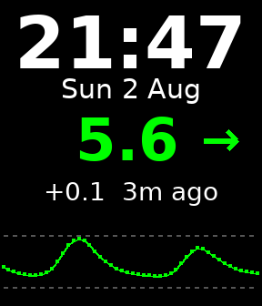

# Libre Glucose — Pebble watchface

A Pebble watchface that shows your current **FreeStyle Libre** glucose
reading, trend arrow, change since the last reading and a 12‑hour history
graph — alongside the time and date.



Data comes from Abbott's **LibreLinkUp** (follower) API via your phone, so
it works with Libre 2 / Libre 3 sensors that upload to LibreView through the
patient's LibreLink app. No extra hardware or third‑party uploader needed.

```
┌──────────────────────┐
│       21:47          │  time + date
│     Sun 2 Aug        │
│                      │
│      5.6  ➘          │  glucose + trend arrow
│    -0.2  3m ago      │  delta + reading age
│  ····················│  high threshold line
│      ~~·~··~~~~      │  12 h graph
│  ····················│  low threshold line
└──────────────────────┘
```

* Colour-coded reading: green in range, red below the low threshold,
  yellow above the high threshold (colour Pebbles).
* mmol/L or mg/dL, configurable low/high thresholds.
* Dark (default) or light theme.
* Optional vibration alert when crossing low (double pulse) or high
  (single pulse).
* Reading age indicator; the value dims when data is stale (>15 min).
* Last data is cached on the watch, so something sensible shows straight
  after a restart.
* Supports Aplite, Basalt, Diorite and Chalk (round) Pebbles.

> ⚠️ **Disclaimer:** this is a hobby project. It is **not** a medical
> device and must not be used for treatment decisions. Always confirm with
> the LibreLink app or a blood test.

## Setting up LibreLinkUp sharing

The watchface signs in as a LibreLinkUp *follower*, the same way apps like
a parent's phone would:

1. On the **patient's** phone, open the **LibreLink** app and choose
   **Share → Connected apps → LibreLinkUp → Manage** and invite an email
   address (it can be your own second account).
2. Install the **LibreLinkUp** app, create an account with that email and
   accept the invitation.
3. In the Pebble app, open the watchface **settings** and enter the
   LibreLinkUp email and password, pick units and thresholds, then Save.

Leave *Region* on “Auto detect” unless login fails — the API redirects to
your regional server automatically.

## Building

Install the Pebble SDK — the easiest route today is the
[Rebble/Core Devices tooling](https://help.rebble.io/sdk/):

```sh
python3 -m pip install pebble-tool
pebble sdk install latest
```

Then:

```sh
pebble build
pebble install --phone <phone IP>      # with developer connection enabled
# or run in the emulator:
pebble install --emulator basalt
```

## How it works

* `src/c/main.c` — the watchface. Renders time, glucose, trend arrow,
  delta/age line and the graph; caches the last snapshot in persistent
  storage; vibrates on threshold crossings.
* `src/pkjs/index.js` — runs on the phone. Logs into the LibreLinkUp API
  (`/llu/auth/login`, `/llu/connections`, `/llu/connections/<id>/graph`),
  polls on a timer and pushes readings to the watch over AppMessage.
* `src/pkjs/config.js` — [Clay](https://github.com/pebble/clay)
  configuration page (credentials, region, units, thresholds, alerts,
  refresh interval).

## Privacy & security

* Your LibreLinkUp email and password are stored **in plain text** in the
  Pebble phone app's local storage on your phone (the LibreLinkUp API only
  supports password login, so the app must keep the password to re-login
  when the session expires). They never leave the phone except over HTTPS
  to Abbott's LibreView servers, and are never sent to the watch.
* The API hostname is validated so a malformed server response cannot
  redirect credentials to a third-party host.
* Consider using a dedicated LibreLinkUp follower account with its own
  password rather than reusing a password from another account.
* The watch itself only ever stores glucose values and thresholds — no
  credentials.

## Publishing / installing for others

Build with `pebble build` and share the `.pbw` from `build/`, or publish
through the [Rebble developer portal](https://dev-portal.rebble.io/):
create the app listing, upload the `.pbw`, and add a screenshot for each
platform. The screenshot doubles as the watchface tile shown in the
phone app's watchface list, so it is worth getting right.

Ready-to-upload images in the native store sizes are in `assets/store/`
(144x168 for aplite/basalt/diorite, 180x180 for chalk), rendered from the
layout in `main.c` by `assets/generate_previews.py`. They are mock-ups —
real captures via `pebble screenshot --emulator basalt` (etc.) are better
still, and drop-in replacements.

## Notes & limitations

* LibreLinkUp readings update once a minute (Libre 2/3); the default poll
  is every 5 minutes to be kind to your phone battery — configurable down
  to 1 minute.
* The graph shows ~12 hours at 15‑minute resolution.
* If you see **“Accept terms in LinkUp app”**, open the LibreLinkUp app
  and accept the updated terms of use, then it will work again.
* This uses an unofficial API; Abbott could change it at any time.
